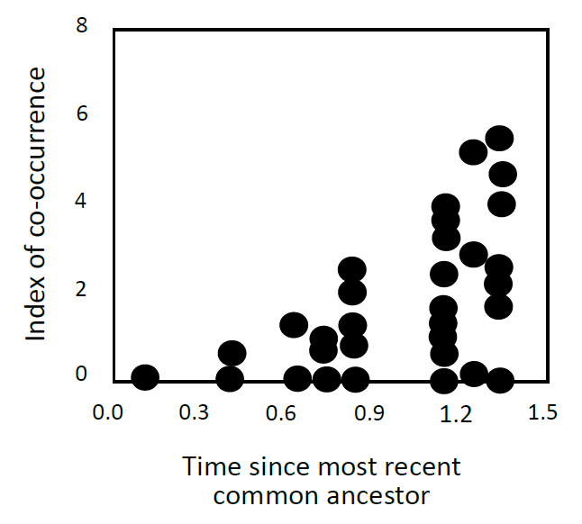

```{r setup, include=FALSE}
knitr::opts_chunk$set(echo = FALSE, fig.pos = "H")
```

1. 
    a. Giving an example, explain what is meant by "phylogenetic niche conservatism" and explain why it occurs. \hfill (6)
    b. The figure below depicts fine-scale co-occurrence (with 5m x 5m plots) between pairs of _Erica_ species in relation to their phylogenetic relatedness (each point represents a species pair). Describe the pattern and provide an explanation for it. \hfill (4)
	```{r question-1-b-figure, out.width="5cm"}
	
	```

2. Explain the concept of "phylogenetic niche conservatism" and discuss its relevance to understanding patterns of local-scale species coexistence. \hfill (8)

3. Explain what is meant by an "adaptive landscape" and, giving an example, explain how interactions among traits/loci generate complexity in the adaptive landscape. \hfill (7)

4. Using a diagram, explain the concept of the "adaptive landscape", and discuss two factors that may limit a population's movement over a particular adaptive landscape. \hfill (10)

5. Explain the concept of "phylogenetic trait conservatism" and, using TWO examples, explain why it needs to be included in the explanation of biological patterns, such as trait-environment associations, community composition, and global distribution patterns. \hfill (15)

6. Explain what is meant by a "fitness interaction" (e.g. epistasis) and, with reference to adaptive landscapes, describe how such interactions may underpin phylogenetic conservatism of organismal traits and niches. \hfill (10)

7. Answer either a. or b.
	a. In the context of adaptive landscapes, explain why plant or animal species that coexist in a common selective environment are often very similar but sometimes very different in terms of structure and function. \hfill (15)
	b. Using real examples to illustrate your answer, discuss the potential utility of phylogenetic information to predict the invasiveness of alien plant or animal species. \hfill (15)
